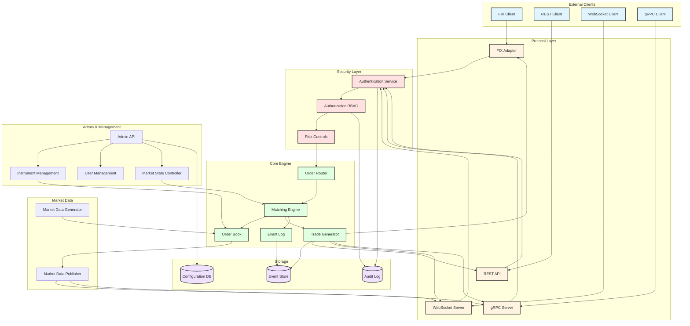

```mermaid
graph TB
    subgraph "External Clients"
        FIX[FIX Client]
        REST[REST Client]
        WS[WebSocket Client]
        GRPC[gRPC Client]
    end
    
    subgraph "Protocol Layer"
        FIXAdapter[FIX Adapter]
        RESTAdapter[REST API]
        WSAdapter[WebSocket Server]
        GRPCAdapter[gRPC Server]
    end
    
    subgraph "Security Layer"
        Auth[Authentication Service]
        AuthZ[Authorization RBAC]
        RiskCtrl[Risk Controls]
    end
    
    subgraph "Core Engine"
        OrderRouter[Order Router]
        MatchEngine[Matching Engine]
        OrderBook[Order Book]
        TradeGen[Trade Generator]
        EventLog[Event Log]
    end
    
    subgraph "Market Data"
        MDGen[Market Data Generator]
        MDPub[Market Data Publisher]
    end
    
    subgraph "Admin & Management"
        AdminAPI[Admin API]
        InstrMgmt[Instrument Management]
        UserMgmt[User Management]
        MarketState[Market State Controller]
    end
    
    subgraph "Storage"
        EventStore[(Event Store)]
        ConfigDB[(Configuration DB)]
        AuditLog[(Audit Log)]
    end
    
    %% Client to Protocol Layer
    FIX --> FIXAdapter
    REST --> RESTAdapter
    WS --> WSAdapter
    GRPC --> GRPCAdapter
    
    %% Protocol Layer to Security
    FIXAdapter --> Auth
    RESTAdapter --> Auth
    WSAdapter --> Auth
    GRPCAdapter --> Auth
    
    %% Security Flow
    Auth --> AuthZ
    AuthZ --> RiskCtrl
    
    %% Security to Core
    RiskCtrl --> OrderRouter
    
    %% Core Engine Flow
    OrderRouter --> MatchEngine
    MatchEngine --> OrderBook
    MatchEngine --> TradeGen
    MatchEngine --> EventLog
    
    %% Market Data Flow
    MDGen --> OrderBook
    OrderBook --> MDPub
    MDPub --> WSAdapter
    MDPub --> GRPCAdapter
    
    %% Admin Flow
    AdminAPI --> InstrMgmt
    AdminAPI --> UserMgmt
    AdminAPI --> MarketState
    InstrMgmt --> OrderBook
    MarketState --> MatchEngine
    
    %% Storage
    EventLog --> EventStore
    TradeGen --> EventStore
    AdminAPI --> ConfigDB
    Auth --> AuditLog
    AuthZ --> AuditLog
    
    %% Execution Reports back to clients
    TradeGen --> FIXAdapter
    TradeGen --> RESTAdapter
    TradeGen --> WSAdapter
    TradeGen --> GRPCAdapter
    
    classDef external fill:#e1f5ff,stroke:#333,stroke-width:2px
    classDef protocol fill:#fff4e1,stroke:#333,stroke-width:2px
    classDef security fill:#ffe1e1,stroke:#333,stroke-width:2px
    classDef core fill:#e1ffe1,stroke:#333,stroke-width:2px
    classDef storage fill:#f0e1ff,stroke:#333,stroke-width:2px
    
    class FIX,REST,WS,GRPC external
    class FIXAdapter,RESTAdapter,WSAdapter,GRPCAdapter protocol
    class Auth,AuthZ,RiskCtrl security
    class OrderRouter,MatchEngine,OrderBook,TradeGen,EventLog core
    class EventStore,ConfigDB,AuditLog storage
```

**System Architecture Diagram**
This diagram shows the high-level architecture with protocol abstraction, security layers, and core matching engine components.
