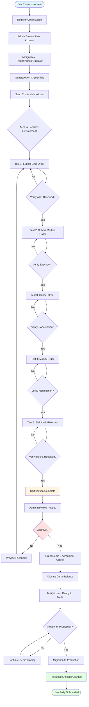

```mermaid
flowchart TD
    Start([User Requests Access]) --> Register[Register Organization]
    Register --> CreateUser[Admin Creates User Account]
    CreateUser --> AssignRole[Assign Role: Trader/Admin/Operator]
    AssignRole --> GenCreds[Generate API Credentials]
    GenCreds --> SendCreds[Send Credentials to User]
    
    SendCreds --> Sandbox{Access Sandbox Environment}
    
    Sandbox --> Cert1[Test 1: Submit Limit Order]
    Cert1 --> Check1{Verify ACK Received?}
    Check1 -->|No| Cert1
    Check1 -->|Yes| Cert2[Test 2: Submit Market Order]
    
    Cert2 --> Check2{Verify Execution?}
    Check2 -->|No| Cert2
    Check2 -->|Yes| Cert3[Test 3: Cancel Order]
    
    Cert3 --> Check3{Verify Cancellation?}
    Check3 -->|No| Cert3
    Check3 -->|Yes| Cert4[Test 4: Modify Order]
    
    Cert4 --> Check4{Verify Modification?}
    Check4 -->|No| Cert4
    Check4 -->|Yes| Cert5[Test 5: Risk Limit Rejection]
    
    Cert5 --> Check5{Verify Reject Received?}
    Check5 -->|No| Cert5
    Check5 -->|Yes| CertComplete[Certification Complete]
    
    CertComplete --> AdminReview[Admin Reviews Results]
    AdminReview --> Approve{Approve?}
    
    Approve -->|No| Review[Provide Feedback]
    Review --> Cert1
    
    Approve -->|Yes| GrantAccess[Grant Demo Environment Access]
    GrantAccess --> FundDemo[Allocate Demo Balance]
    FundDemo --> Notify[Notify User - Ready to Trade]
    
    Notify --> ProdReady{Ready for Production?}
    ProdReady -->|No| DemoTrading[Continue Demo Trading]
    DemoTrading --> ProdReady
    
    ProdReady -->|Yes| ProdMigration[Migration to Production]
    ProdMigration --> ProdAccess[Production Access Granted]
    ProdAccess --> End([User Fully Onboarded])
    
    style Start fill:#e1f5ff
    style End fill:#e1ffe1
    style CertComplete fill:#fff4e1
    style ProdAccess fill:#e1ffe1
    style Approve fill:#ffe1e1
```

**User Onboarding Workflow**
This flowchart shows the complete user onboarding process from registration through certification to production access.
