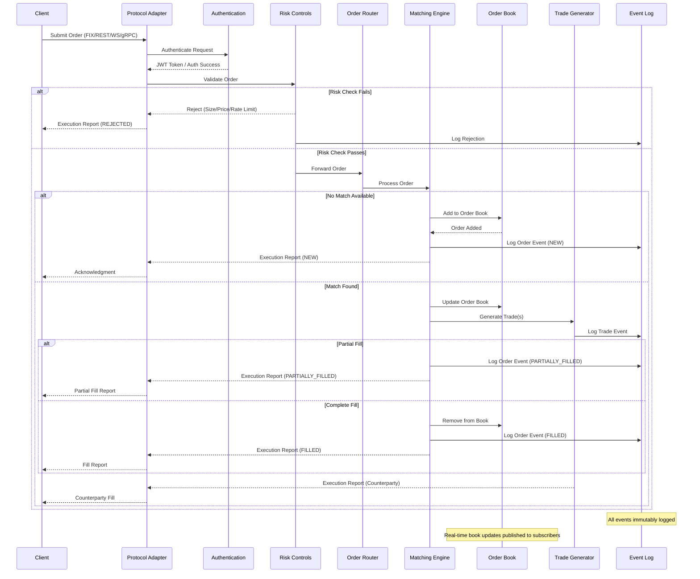

```mermaid
sequenceDiagram
    participant Client
    participant Protocol as Protocol Adapter
    participant Auth as Authentication
    participant Risk as Risk Controls
    participant Router as Order Router
    participant Match as Matching Engine
    participant Book as Order Book
    participant Trade as Trade Generator
    participant Log as Event Log
    
    Client->>Protocol: Submit Order (FIX/REST/WS/gRPC)
    Protocol->>Auth: Authenticate Request
    Auth-->>Protocol: JWT Token / Auth Success
    
    Protocol->>Risk: Validate Order
    
    alt Risk Check Fails
        Risk-->>Protocol: Reject (Size/Price/Rate Limit)
        Protocol-->>Client: Execution Report (REJECTED)
        Risk->>Log: Log Rejection
    else Risk Check Passes
        Risk->>Router: Forward Order
        Router->>Match: Process Order
        
        alt No Match Available
            Match->>Book: Add to Order Book
            Book-->>Match: Order Added
            Match->>Log: Log Order Event (NEW)
            Match-->>Protocol: Execution Report (NEW)
            Protocol-->>Client: Acknowledgment
            
        else Match Found
            Match->>Book: Update Order Book
            Match->>Trade: Generate Trade(s)
            Trade->>Log: Log Trade Event
            
            alt Partial Fill
                Match->>Log: Log Order Event (PARTIALLY_FILLED)
                Match-->>Protocol: Execution Report (PARTIALLY_FILLED)
                Protocol-->>Client: Partial Fill Report
                
            else Complete Fill
                Match->>Book: Remove from Book
                Match->>Log: Log Order Event (FILLED)
                Match-->>Protocol: Execution Report (FILLED)
                Protocol-->>Client: Fill Report
            end
            
            %% Counterparty notification
            Trade-->>Protocol: Execution Report (Counterparty)
            Protocol-->>Client: Counterparty Fill
        end
    end
    
    Note over Log: All events immutably logged
    Note over Book: Real-time book updates published to subscribers
```

**Order Lifecycle Flow**
This sequence diagram shows the complete flow of an order from submission through authentication, risk checks, matching, and execution reporting.
