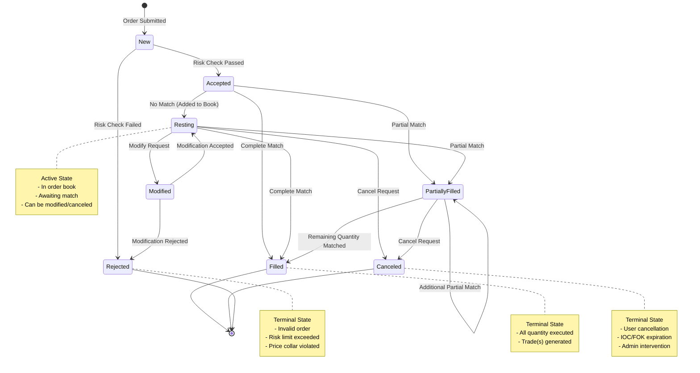

```mermaid
stateDiagram-v2
    [*] --> New: Order Submitted
    
    New --> Rejected: Risk Check Failed
    New --> Accepted: Risk Check Passed
    
    Accepted --> PartiallyFilled: Partial Match
    Accepted --> Filled: Complete Match
    Accepted --> Resting: No Match (Added to Book)
    
    Resting --> PartiallyFilled: Partial Match
    Resting --> Filled: Complete Match
    Resting --> Canceled: Cancel Request
    Resting --> Modified: Modify Request
    
    Modified --> Resting: Modification Accepted
    Modified --> Rejected: Modification Rejected
    
    PartiallyFilled --> Filled: Remaining Quantity Matched
    PartiallyFilled --> Canceled: Cancel Request
    PartiallyFilled --> PartiallyFilled: Additional Partial Match
    
    Filled --> [*]
    Canceled --> [*]
    Rejected --> [*]
    
    note right of Rejected
        Terminal State
        - Invalid order
        - Risk limit exceeded
        - Price collar violated
    end note
    
    note right of Filled
        Terminal State
        - All quantity executed
        - Trade(s) generated
    end note
    
    note right of Canceled
        Terminal State
        - User cancellation
        - IOC/FOK expiration
        - Admin intervention
    end note
    
    note right of Resting
        Active State
        - In order book
        - Awaiting match
        - Can be modified/canceled
    end note
```

**Order State Machine**
This state diagram shows all possible order states and valid transitions between them.
